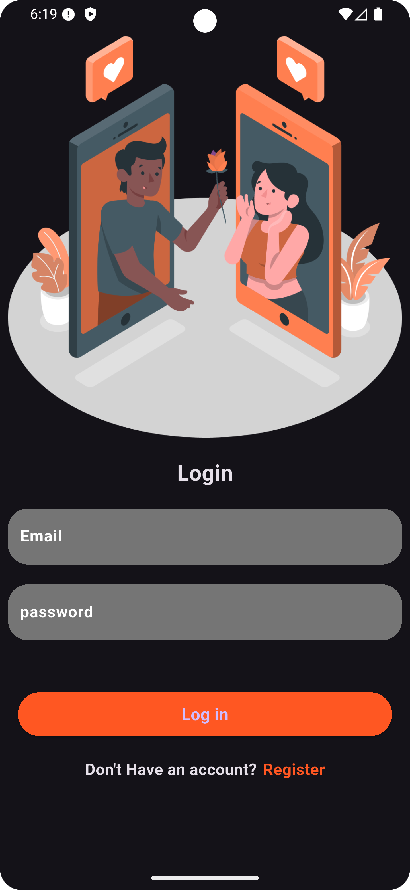
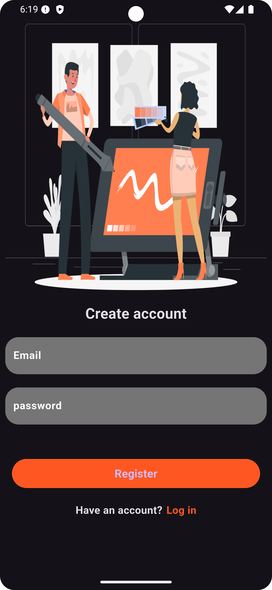
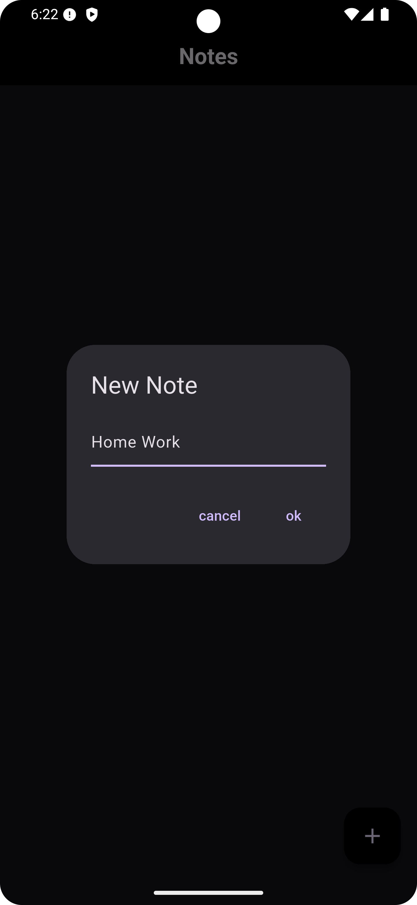
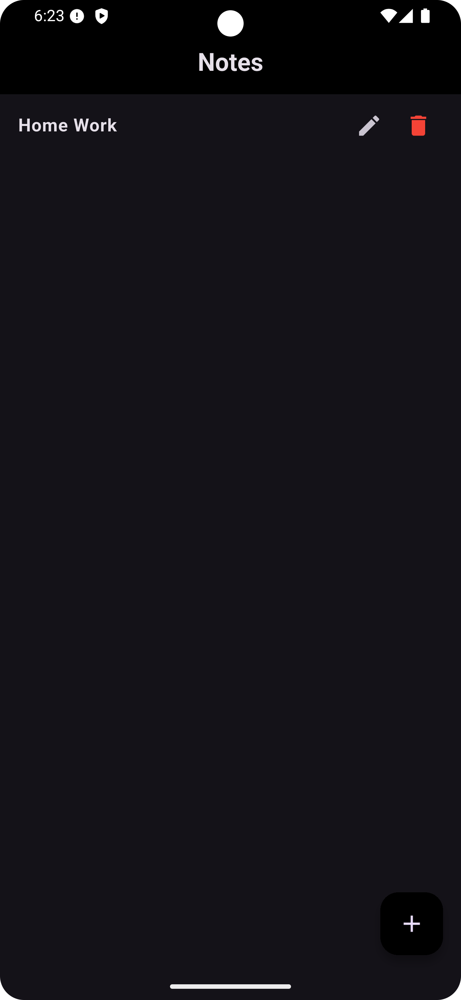

##   Flutter Note App

📸 Screenshots

  
  
  
  

## 🌟 Overview

1. Create Notes – Add new notes with title and content.

2. Read Notes – List all saved notes on the home screen.

3. Update Notes – Edit existing notes.

4. Delete Notes – Remove notes permanently.

5. (Optional) Auth – Users sign in to manage their own notes.

## 🚀 Features

- 📜 **Note Details:** Fetch and display all details using Supabase.
- 📱 **Responsive UI:** Optimized for both phones and tablets.
- 🌙 **Note Design Touch:** Minimal and calm user interface aligned with the purpose of the app.
- ⚡ **Smooth Performance:** Built with best practices to ensure fast loading and responsiveness.

---

